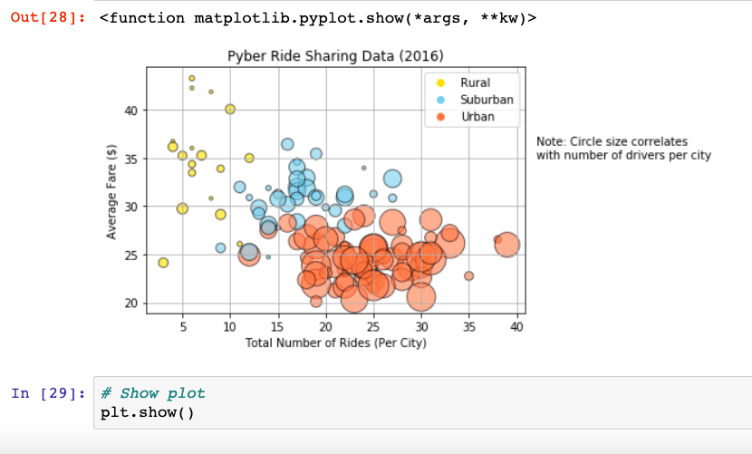
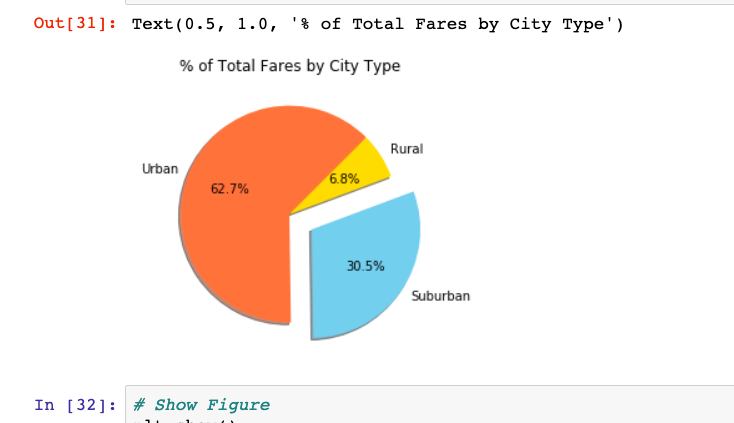

# Pyber-Analysis-Matplotlib

This project analyzed rider information for a fictional ridesharing app using python, pandas and matplotlib.  

## Visualization-Preview

## Analysis

When analyzing the data for Pyber, we can see several trends. Urban areas are where Pyber is generating the most revenue, has the highest percentage of drivers and rides.  Increasing the number of drivers in suburban and rural areas may help Pyber to increase overall revenue and grow their user base. While there are significantly more rides generated per city in Urban areas, the fares generated by rides are lower than in suburban or rural areas.  Increasing the number of rides in Suburban and Rural areas will increase revenue generated from these city types.  There are also some Urban areas that have far fewer drivers than other Urban areas.  Targeting these areas with incentives for drivers may increase revenue generated from Urban areas.
